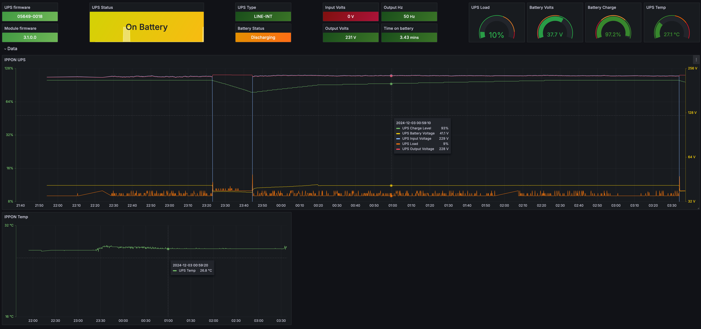

Simple client to push all data from IPPON UPS with SNMP modules to InfluxDB and Grafana


1) make build 
2) docker-compose up -d


docker-compose.yml
```docker
version: "2.1"
services:
  ippon:
    image: ippon
    container_name: ippon
    environment:
      - INFLUX_DBURL=http://10.0.0.196:8086
      - INFLUX_TOKEN=
      - INFLUX_ORG=
      - INFLUX_BUCKET=
    read_only: false
    stop_grace_period: 30m
    network_mode: "host"
    tty: true
    restart: unless-stopped
```

